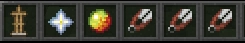

# Armor Stand Tools

**Armor Stand Tools** — это плагин, предоставляющий полный набор инструментов для удобной кастомизации стоек для брони.

## Команды

- `/astools`  
  Выдаёт все инструменты. При этом инвентарь очищается, но ваши вещи возвращаются при повторном использовании команды.

## Руководство

Для начала работы введите команду `/astools` или `/ast`.  
Вам будет выдано специальное меню в виде предметов управления, а ваши текущие вещи временно исчезнут. Они вернутся при повторном использовании команды.  

**Использование:**  
Держа в руках любой из выданных предметов, кликайте левой кнопкой мыши, чтобы переключать «меню» в хотбаре.

### Инструменты первого меню

1. **Создание стенда**  
   Нажмите ПКМ на первую кнопку — создастся стойка, которая будет левитировать перед вашим прицелом, пока вы снова не нажмёте ЛКМ или ПКМ.

2. **Вращение стенда**  
   Третья кнопка позволяет вращать стойку вокруг своей оси. Кликните ПКМ по стойке, чтобы повернуть её. Угол вращения зависит от высоты клика по телу.

3. **Перемещение стенда**  
   Последние три кнопки (ножницы) предназначены для перемещения стойки по координатам X, Y и Z:
   - ПКМ перемещает на +0.1 по выбранной оси.  
   - ПКМ с зажатым Shift перемещает на -0.1.  
   

4. **Дополнительные настройки**  
   Кликните ПКМ со звездой Незера в руках, чтобы открыть меню настроек стойки:  
   - **Кусочек золота**: включает и отключает видимость стойки (не экипировки).  
   - **Перо**: поднимает и переносит стойку.  
   - **Светопыль**: копирует стойку.  
   - **Командный блок**: создаёт командный блок для создания аналогичной стойки.  
   - **Стрела**: включает и отключает видимость рук.  
   - **Каменная плита**: включает и отключает видимость основы стойки.  
   - **Изумруд**: изменяет размер стойки (обычная или маленькая).  
   - **Слеза Гаста**: включает и отключает действие гравитации.  
   - **Сверкающий арбуз**: включает и отключает неуязвимость стойки.  
   - **Мотыга**: блокирует экипировку (нельзя снять её через ПКМ по стойке).  
   

### Дополнительные меню

Для переключения между меню нажимайте ЛКМ по любому предмету.  

1. **Настройка рук:**  
   Положение левой и правой руки настраивается по осям X, Y и Z. Угол изменения зависит от высоты клика по телу.  
   

2. **Настройка ног:**  
   Аналогично, настраивается положение левой и правой ноги по осям X, Y и Z.  
   

3. **Настройка туловища и головы:**  
   Регулируется положение туловища и головы по осям X, Y и Z.  

    