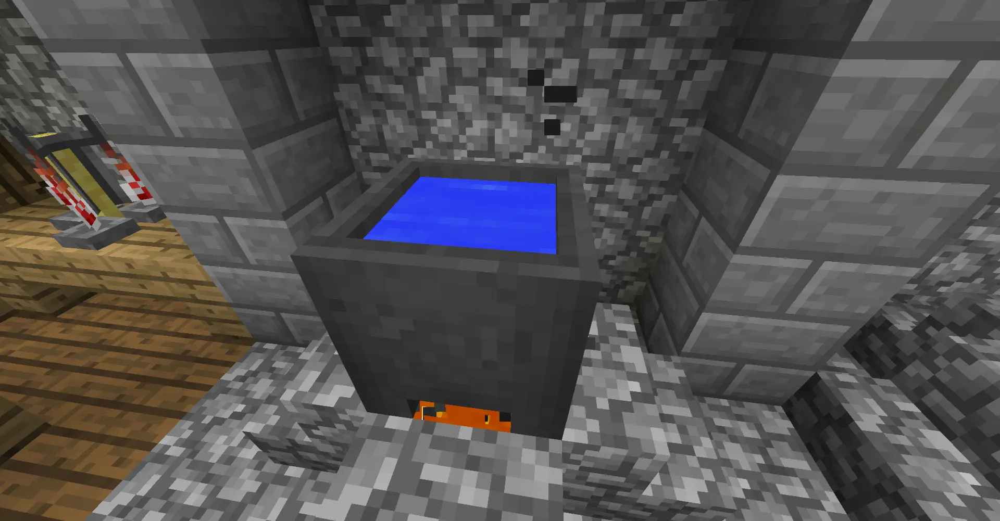
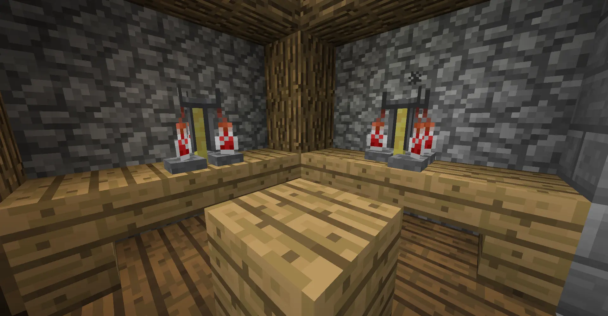
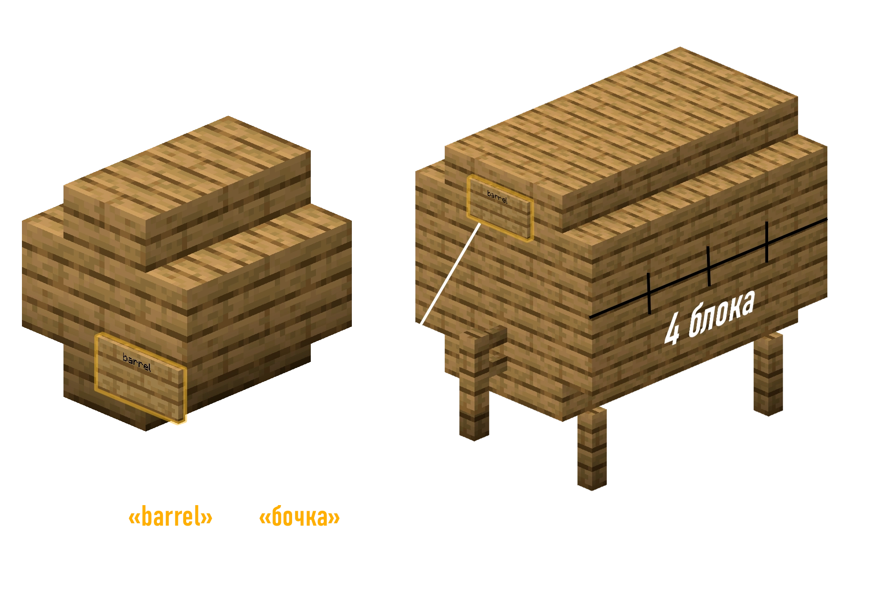

# Как варить?

Время варки!
:::warning ВАЖНО
В варке напитков самое важное - следовать рецепту, ведь, в зависимости от установленной сложности напитка, брага может получится неудачной.
:::

Для варки подготовь Котёл, Варочную стойку и Бочку.

## Ферментирование

Здесь мы начинаем варить напиток по ингредиентам!

1. Поставь Котёл над любым горящим блоком - Огонь/Лава/Магма/Прочее

2. Наполни котёл водой

3. Добавь необходимые ингредиенты в котёл, нажимая ПКМ

4. ПКМ по котлу **Часами** покажет в чат сколько времени напиток варится

5. Когда нужно - нажми ПКМ по котлу **пустыми колбами**, чтобы наполнить их напитком

6. ???

7. ПРОФИТ!

## Дистилляция

Некоторым рецептам нужна дистиляция.

1. Положи напиток в зельеварочную стойку

2. Положи **светопыль** в верхний слот

3. Подожди пока дистиляция пройдёт

4. ???

5. ПРОФИТ!

## Брожение

Многим напиткам нужно **забродить** из браги в напиток или чтобы улучшить качество напитка. А брожжение это просто... ожидание!

Для этого тебе нужна **Бочка**. Ты можешь использовать обычную бочку из Майнкрафта, она будет работать как бочка **из дуба** и вмещает в себя 6 напитков. Но также ты можешь построить структуру - среднюю или большую бочку. Они нужны, если в рецепте необходимо определенное дерево или просто для увеличения слотов!

После того, как ты положил напитки в бочки, тебе достаточно просто ждать! 1 "год" (В системе напитков равняется 1 внутриигровому дню.)

# Рецепты

| Рецепт       | Ингрeдиенты                | Время кипения   | Дистилляция | Выдержка/Дерево | Уровень алкоголя | Эффекты |
|-------------|-------------|-----|-----|-------|-----|---|
| Пиво             | 6 Пшеницы                                      | 8 Минут               | Нет  | 3 Года Любое          | I      |    |
| Пшеничное пиво   | 3 Пшеницы                                      | 8 Минут               | Нет  | 2 Года Береза         | I      |    |
| Темное пиво      | 6 Пшеницы                                      | 8 Минут               | Нет  | В 3 раза дольше чем пиво Темный дуб| I' |    |
| Бельгийское пиво | 8 Пшеницы, 3 Сладких ягоды                     | 8 Минут               | Нет  | 5 Лет Дуб             | I'     | -  |
| Красное вино     | 5 Сладких ягод                                 | 5 Минут               | Нет  | Коротко Any           | I'     |    |
| Медовуха         | 6 Сахарный тростник                            | 3 Минуты              | Нет  | 4 Года Дуб            | I'     |    |
| Яблочный Мид     | 6 Сахарный тростник Яблоко                  | Одинаково с медовухой | Нет  | 4 Года Дуб            | II     | +  |
| Яблочный Сидр    | 14 яблок                                  | 7/8 Минут             | Нет  | 3 Года Любое          | I'     |    |
| Яблочный Ликер   | 12 яблок                                   | Долго                 | Да   | 6 Лет Акация          | II'    |    |
| Коктейль Анархия | 3 Яблока, 5 Сладких ягод, 10 Пшеницы           | 10 Минут              | Нет  | 5 Лет Любое дерево    | I'     | -  |
| Коктейль Бризи   | 2 Стержня ветра, 1 Светло-голубой краситель, 10 Хорусов | 10 минут     | Да   | 3 Года Берёза         | I      |    |
| Коктейль Блэйзи  | 2 Стержня ифрита, 6 Светящихся ягод, 12 Медовых сот | 8 Минут          | Нет  | 3 Года Берёза         | I      | +  |
| Виски            | Пшеница                                        | 1 мин./Пшеница        | Да   | Очень долго Темное    | III'   |    |
| Ром              | 18 сахарного тростника                       | Коротко               | Да   | Долго Дуб             | IIII   | +  |
| Водка            | Одна шестая стака картошки                     | Долго                 | Да   | Нет                      | III    | -  |
| Грибная водка    | 10 Картофеля, 3шт. от каждого вида грибов                                | Очень долго           | Да   | Нет                      | II'    | +- |
| Джин             | 9 Пшеницы 6 синих цветов Яблоко  | Коротко               | Да   | Нет                      | III    |    |
| Текила           | 8 кактусов                             | Долго                 | Да   | Долго Береза          | III    |    |
| Абсент           | 15 травы                                    | Коротко               | Да   | Нет                      | IIIII' | -  |
| Зеленый Абсент   | 17 травы 2 ядовитых картофеля            | Нормально             | Да   | Нет                      | IIIIII | +- |
| Картофельный суп | 5 Картошки 3 травы                    | Коротко               | Нет  | Нет                      |        | +  |
| Кофе             | 12 бобов 2 Ведра молока            | Коротко               | Нет  | Нет                      |        | ++ |
| Эгг-ног          | 5 Яиц 2 сахара 1 Ведро молока      | Коротко               | Нет  | Коротко Любое         | I'     |    |
| Шампанское       | 2 Пшеницы, 3 Светокаменной пыли, 3 Светящихся ягоды | 5 Минут              | Да       | 3 Года Берёза      | I       |            |
| Глинтвейн        | 10 Ягод, 3 Незер нароста, 1 Сахар          | 15 Минут             | Нет      | 4 Года Ель         | I       |            |
| Аперитив         | 6 Ломтиков арбуза, 4 Яблока               | 4 Минуты              | Да       | Пусто                | Пусто   |            |
| Вермут           | 12 Яблок, 3 Медовые соты, 5 Травы          | 8 Минут              | Да       | 2 Года Дуб         | I       |            |
| Сакэ             | 8 Травы, 12 Бамбука, 3 Яйца               | 8 Минут              | Да       | 8 Лет Берёза      | II      |            |
| Сангрия          | 8 Яблок, 7 Сладких ягод, 4 Сахара          | 15 Минут             | Да       | Пусто                | I       |            |
| Итальянская самбука | 5 Сахара, 10 Травы, 3 Какао-бобов          | 15 Минут             | Да       | Пусто                | III      |            |
