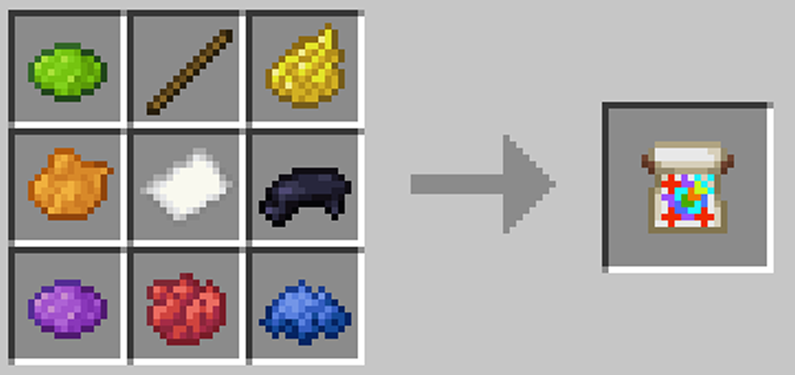
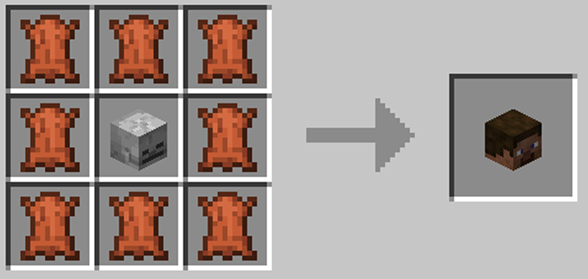

# Головы и их получение

На нашем сервере есть интересная механика, которая позволяет получать головы игроков

Весь процесс состоит из трёх основных этапов:
1.  **Получение инструментов:** Вам понадобится специальный предмет "Полотно для головы игрока".
2.  **Снятие отпечатка:** Вы должны "снять отпечаток" лица другого игрока, перенеся его на бумагу.
3.  **Создание головы:** Используя полученный рисунок и обычную голову, вы создаёте точную копию головы игрока.

## Шаг 1: Получение инструментов

Для начала вам нужен основной предмет — **"Полотно для головы игрока"** и обычная голова

## Шаг 2: Процесс снятия отпечатка

Нужно взять в руку "Полотно для головы игрока", подойти к нужному игроку зажать SHIFT и нажать ПКМ

Начнётся процесс переноса лица на полотно, который длится **6 секунд**.

:::warning ОБРАТИТЕ ВНИМАНИЕ
Оба игрока во время процесса должны стоять на месте
:::

Если вы всё сделали правильно, **"Полотно для головы игрока"** превратится в **"Рисунок головы: [Ник игрока]"**.

## Шаг 3: Создание головы

Теперь, когда у вас есть рисунок, вы можете создать саму голову. Для этого вам понадобится ещё один компонент.

### Рецепт крафта

Для создания головы поместите в сетку крафта два предмета:

1.  **"Рисунок головы игрока"** (полученный на шаге 2).
2.  **Обычная голова**.

В результате вы получите декоративную голову, которая будет точной копией головы игрока, чей отпечаток вы сняли.
