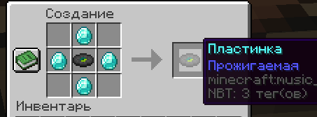

# Своя музыка

На сервере установлен плагин, позволяющий добавлять на пластинки собственную музыку. Для его работы требуется мод **PlasmoVoice**.

## Как использовать

Чтобы создать пластинку, на которую можно записать свою музыку, необходимо изготовить "Прожигаемую" пластинку.

## Команды

- `/disc burn <url> [name]`  
  Создаёт музыкальный диск с пользовательским звуком из указанного URL. Для использования необходимо держать в руке музыкальный диск.

- `/disc erase`  
  Превращает пользовательский диск обратно в обычный.

- `/disc search <query>`  
  Выполняет поиск треков по запросу на YouTube.

## Поддерживаемые источники

Плагин позволяет загружать аудио из следующих платформ:
- Видео и прямые трансляции на **YouTube**
- **SoundCloud**
- **Bandcamp**
- **Vimeo**
- Прямые трансляции на **Twitch**

## Поддерживаемые форматы файлов

Для воспроизведения аудио с прямых URL-адресов поддерживаются следующие форматы:
- **MP3**
- **FLAC**
- **WAV**
- **Matroska/WebM** (кодеки: AAC, Opus, Vorbis)
- **MP4/M4A** (кодек: AAC)
- **OGG** (кодеки: Opus, Vorbis, FLAC)
- **AAC**-потоки
- Потоковые плейлисты (**M3U**, **PLS**)
