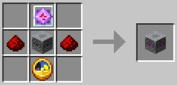

# Защитная станция

`Защитная станция` – это блок, обеспечивающий защиту от взрыва кристаллов в радиусе 16 блоков. 
Если игрок попытается взорвать кристалл в радиусе действия станции, кристалл разрушится, а игрок получит смертельный удар током
